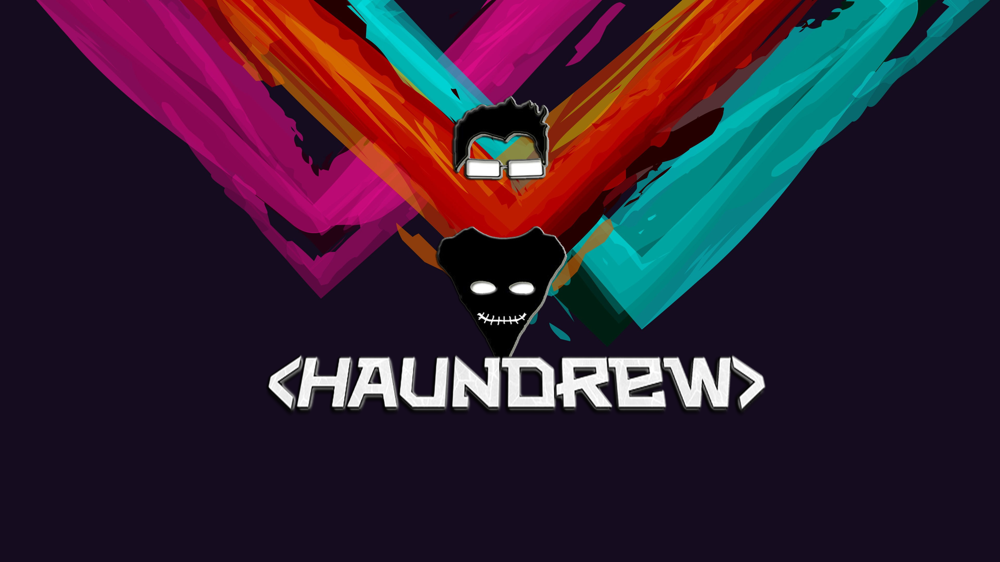

 #  Bienvenid@ a mi GitHub Haundrew Dh 

Recien graduado de la universidad, con aprendizaje constante en las nuevas tecnologias y en la programación web.

## Visita mi Canal de Youtube y mis Redes Sociales

<!--
**haundrew/haundrew** is a ✨ _special_ ✨ repository because its `README.md` (this file) appears on your GitHub profile.

Here are some ideas to get you started:

- 🔭 I’m currently working on ...
- 🌱 I’m currently learning ...
- 👯 I’m looking to collaborate on ...
- 🤔 I’m looking for help with ...
- 💬 Ask me about ...
- 📫 How to reach me: ...
- 😄 Pronouns: ...
- ⚡ Fun fact: ...
-->
